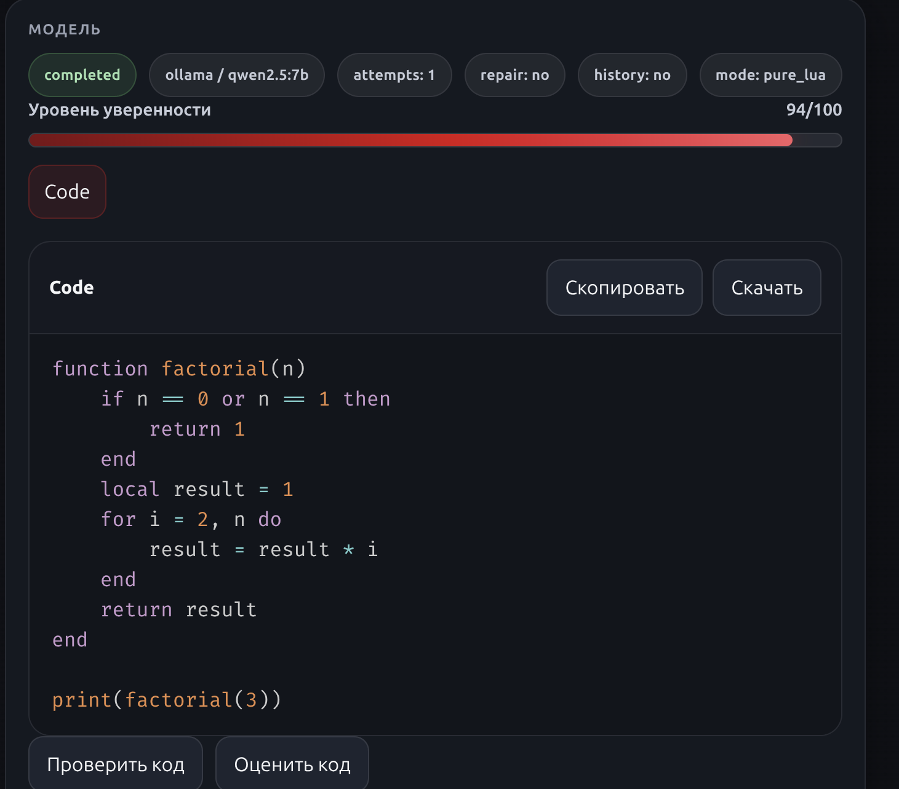
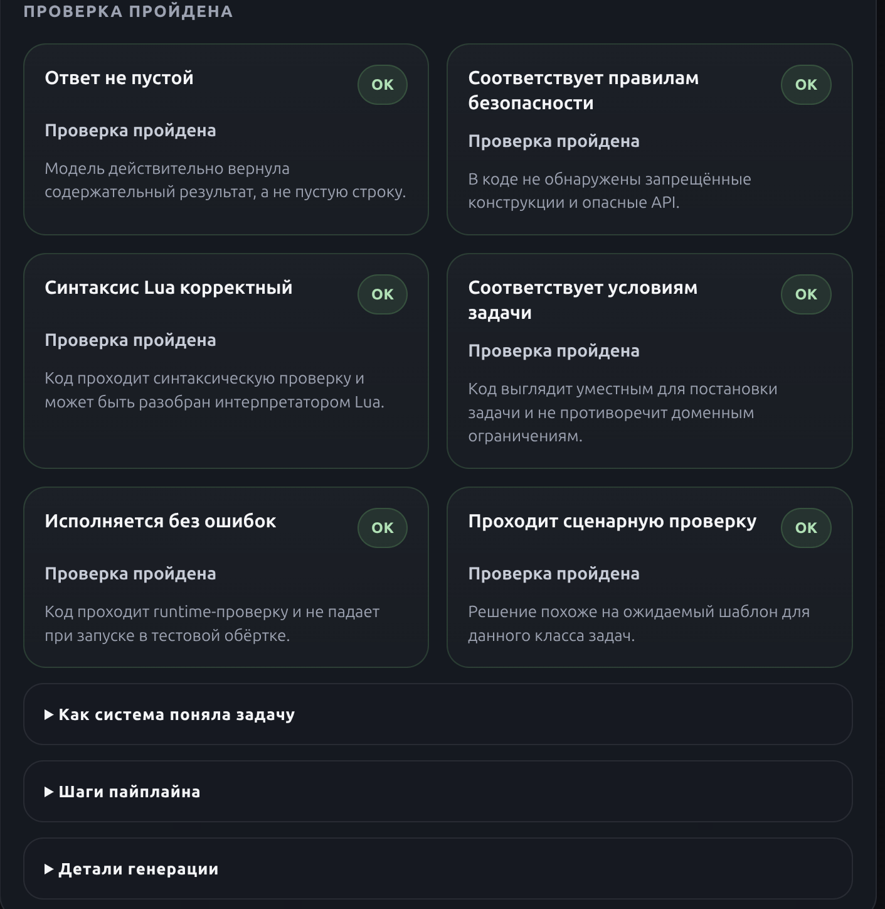
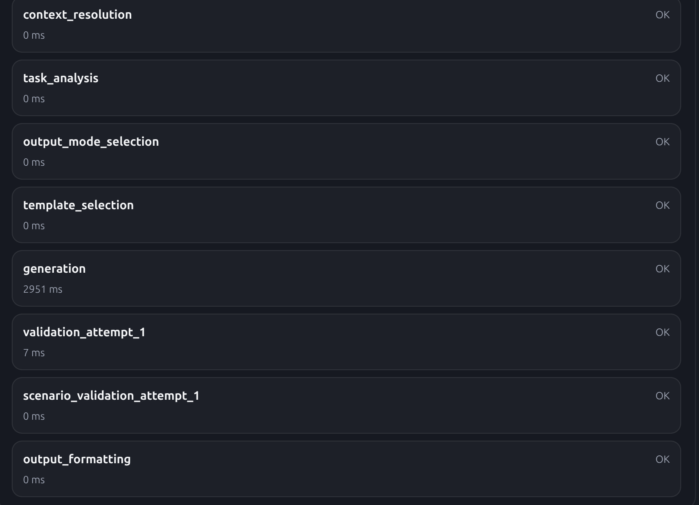
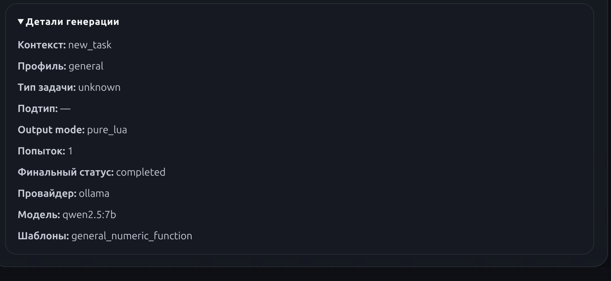
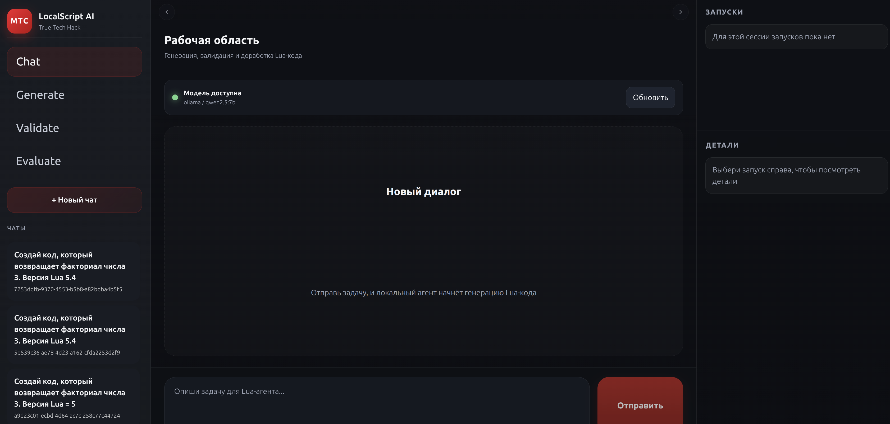
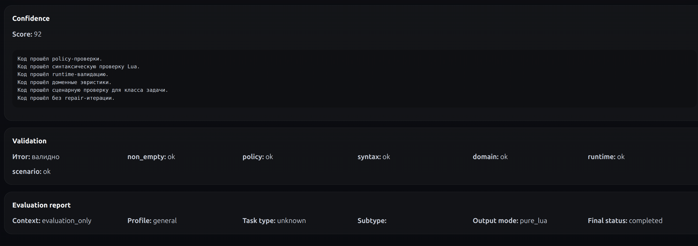

# MTS Local Lua Agent
Controlled Code Generation Pipeline for Secure Lua Development

---

## Abstract

This project presents a locally deployed AI-based system for controlled Lua code generation, designed within the MTS True Tech Hack case. The system addresses key limitations of modern large language model (LLM) tools by introducing a structured, multi-stage pipeline that ensures correctness, security, and reproducibility of generated code.

Unlike traditional “black-box” code generators, the proposed solution integrates task analysis, domain-aware template selection, multi-level validation, automated repair, and evaluation mechanisms. The system is fully containerized and operates without reliance on external APIs, ensuring deterministic behavior and compliance with controlled runtime environments.

---

## Introduction

The use of LLMs in software development has significantly improved developer productivity. However, their application in restricted or security-critical environments remains problematic. In particular, environments such as LowCode platforms and embedded scripting runtimes (e.g., Lua) impose strict constraints on allowed APIs, execution behavior, and code reliability.

The primary objective of this project is to design and implement a secure and reproducible code generation system that overcomes these limitations.

The system focuses on:
- Ensuring syntactic and semantic correctness
- Enforcing policy and domain constraints
- Supporting runtime validation
- Providing transparent evaluation metrics
- Maintaining full local execution without external dependencies

---

## Problem Statement

Modern LLM-based code generation tools suffer from several critical issues:
- Generation of invalid or non-executable code
- Lack of systematic validation mechanisms
- Poor adaptation to specific runtimes (e.g., Lua, LowCode environments)
- Absence of explainability in decision-making
- Non-deterministic behavior due to external API dependence

These problems become particularly important in the MTS context, where:
- Code must run in controlled execution environments
- Use of unauthorized APIs must be prevented
- Outputs must be predictable and reproducible

Thus, a controlled pipeline architecture is required to ensure reliability and security.

---

## System Architecture

The system follows a modular microservice architecture, consisting of four main components:
- FastAPI backend — pipeline orchestration and API layer
- Vite frontend — user interface
- PostgreSQL — persistence layer
- Ollama — local inference engine

---

## Project Structure
```
MTC-TrueTechHack/
├── localscript_backend/
│   ├── app/
│   │   ├── services/
│   │   ├── routers/
│   │   ├── models/
│   │   └── main.py
│   ├── alembic/
│   ├── Dockerfile
│   └── docker-entrypoint.sh
│
├── frontend/
│   ├── src/
│   ├── index.html
│   ├── package.json
│   └── Dockerfile
│
├── docker-compose.yml
├── docker-compose.ollama.yml
└── README.md
```
The backend is responsible for executing the pipeline, while the frontend provides an interface for user interaction and visualization of results.

---

## Methodology: Controlled Generation Pipeline

The core contribution of this project is the multi-stage generation pipeline, which transforms user input into validated and reliable Lua code.

### Pipeline Overview

Each request проходит through the following stages:
1. **Task Analysis**. The system parses the input request, extracting intent, constraints, and domain-specific features. This step reduces ambiguity and prepares structured input for further processing.
2. **Template Selection**. Based on detected context (e.g., general Lua vs LowCode), the system selects predefined templates and rules. This ensures alignment with the target runtime environment.
3. **Code Generation**. The LLM (via Ollama) produces candidate Lua code using controlled prompts and contextual constraints.
4. **Multi-Level Validation**. Generated code is validated across several dimensions:
- Syntax validation — checks for Lua parsing correctness
- Policy validation — ensures forbidden APIs are not used
- Domain validation — verifies compliance with LowCode constraints
- Runtime validation — executes code in a sandbox
- Scenario validation — checks expected functional behavior
- Repair Stage (Optional). If validation fails, the system automatically attempts to fix errors using corrective prompts.
5. **Evaluation**. The final output is assessed using a confidence scoring mechanism that reflects code quality and reliability.

### Pipeline Design Principles

The pipeline is built on several key principles:
- Determinism — identical inputs produce reproducible outputs
- Transparency — each stage is observable and explainable
- Modularity — stages can be extended or replaced independently
- Security-first design — validation precedes execution

---

## Implementation Details

### Backend
The backend is implemented using FastAPI and follows a service-oriented structure:
- ```services/``` — pipeline stages and business logic
- ```routers/``` — API endpoints
- ```models/``` — database schemas

The backend container performs the following steps on startup:
- waits for database readiness
- applies Alembic migrations
- initializes the API server

### Database

PostgreSQL is used to store:
- user sessions
- pipeline execution states
- generated outputs
- validation reports

This allows traceability and reproducibility of all operations.

### LLM Integration

The system uses Ollama for local inference.
Default model:
```
qwen2.5:7b
```
This ensures:
- no dependency on external APIs
- consistent behavior across runs
- improved data privacy

---

## Results

The system demonstrates the following improvements compared to baseline LLM usage:
- Increased code correctness rate
- Reduced runtime errors
- Improved compliance with domain constraints
- Higher predictability of outputs

---

## Example Outputs

### Validation





### Interface overview



---

## Discussion
The introduction of a controlled pipeline significantly improves the reliability of LLM-based systems.

Unlike naive generation approaches, this system:
- explicitly separates generation and validation
- introduces feedback loops via repair stage
- enforces domain-specific constraints
However, limitations remain:
- performance overhead due to multi-stage validation
- dependency on prompt quality for repair stage
- limited scalability without optimization

---

## Conclusion

This project demonstrates that LLM-based code generation can be made reliable and secure when combined with a structured pipeline architecture.

The system achieves:
- controlled and explainable generation
- robust validation mechanisms
- full local deployment

These properties make it suitable for enterprise environments, particularly where security and reproducibility are critical.
Future improvements may include:
- static analysis enhancements
- caching intermediate results
- parallel validation stages

---

## Deployment Guide

### Requirements

- Docker
- Docker compose

### Basic Setup
```
docker compose up -d --build
```
### Access:

- Frontend: http://localhost:5173  
- Backend: http://localhost:8000  
- Health:  http://localhost:8000/health

### Full Setup with LLM
```
docker compose -f docker-compose.yml -f docker-compose.ollama.yml up -d --build
```

--- 

### Environment Variables
```
POSTGRES_DB
POSTGRES_USER
POSTGRES_PASSWORD
OLLAMA_BASE_URL
OLLAMA_MODEL
REQUEST_TIMEOUT_SECONDS
```

---

### Team

- [Илья Матвеев](http://t.me/hep2014) - pipeline setup, backend, llm user
- [Анастасия Кабанова](https://t.me/anastaness) - deep learning
- [Мясников Евгений](https://t.me/Myzn1k) - data engineering
- [Щеголев Иван](https://t.me/hep2O14) - frontend developer
- [Косинский Эдуард](https://t.me/tominvst) - backend developer
